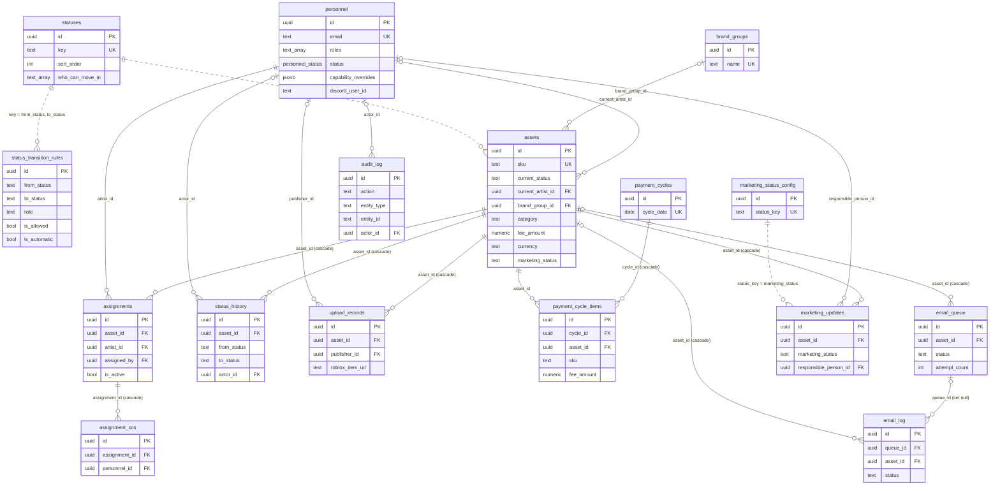
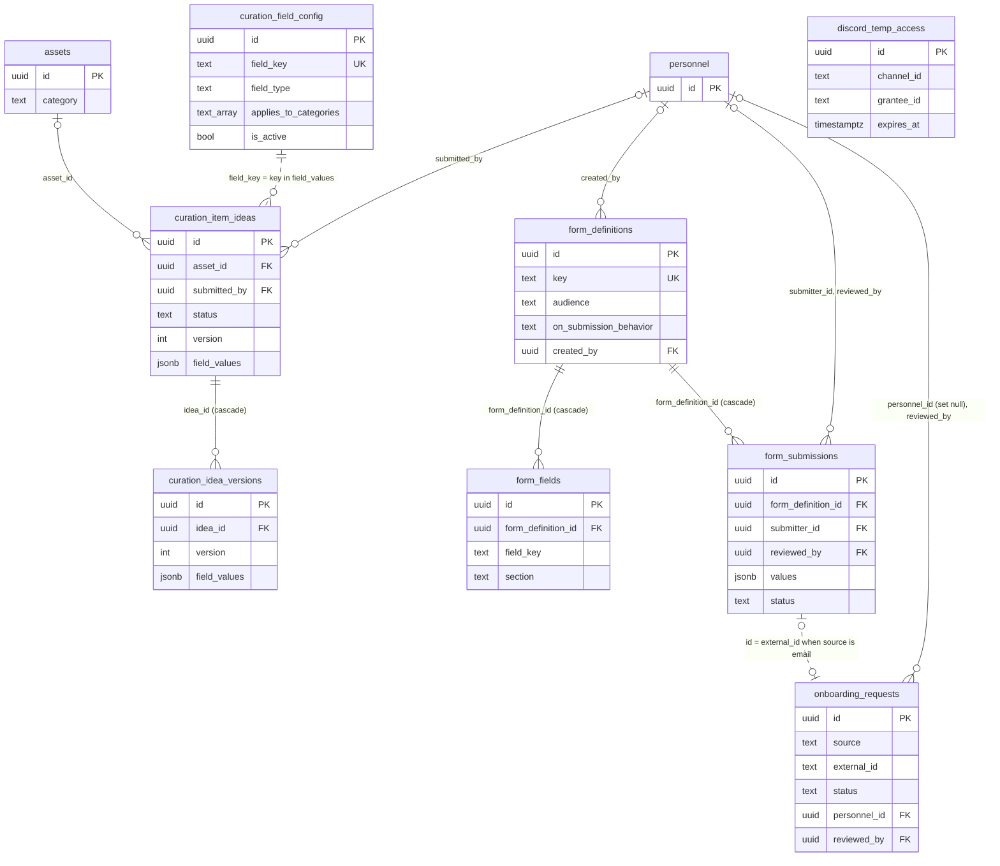
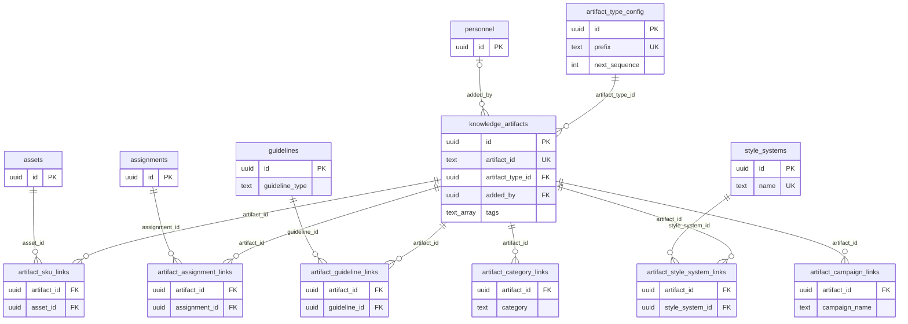

# Entity relationship diagram

The database has 34 tables and one enum (`personnel_status`: `Active`, `Blacklisted`, `Inactive`). Each table is defined in `web/lib/db/schema/<table>.ts`, which is the source for everything below. Every primary key is a `uuid` named `id` with a random default, and every timestamp is `timestamp with time zone`.

The diagrams show primary keys, foreign keys and the columns other tables depend on. Solid lines are foreign key constraints. Dotted lines are joins on a text value with no constraint, and the database won't stop those values from going stale.

## Production pipeline

An asset is one catalog item, identified by `sku`. Its stage is `assets.current_status`, which holds a `statuses.key`.

Pipeline status keys, in `sort_order`, as seeded by `lib/db/seed-statuses.ts`: `unassigned`, `assigned`, `in_progress`, `in_review`, `revisions_requested`, `approved`, `final_files_received`, `ready_for_upload`, `uploaded_to_roblox`, `marked_for_payment`, `payment_done`.

Marketing status keys, as seeded by `lib/marketing/marketing-service.ts`: `not_planned`, `planned`, `creative_needed`, `scheduled`, `posted`, `boosted_promoted`, `performance_reviewed`, `needs_repost`, `done`.

## Curation, forms and onboarding

A curator drafts an idea in `curation_item_ideas`. Submitting it creates an asset and sets `curation_item_ideas.asset_id`. Forms are admin-built, and the public artist access form feeds `onboarding_requests`.

`discord_temp_access` has no relations. It stores Discord channel permission grants with an expiry, read by the cron at `app/api/admin/discord/expire-temp-access/route.ts`.

## Registry (knowledge artifacts)

The UI calls this area "Registry". The code and tables still use `knowledge`. An artifact gets a permanent ID such as `TR001` from its type's prefix and `next_sequence`, and it can be attached to six kinds of target through link tables.

Each link table has a unique constraint on its pair of columns, so an artifact links to a given target once. None of the link foreign keys cascade, so deleting an artifact, asset or assignment that has links fails until the link rows are deleted.

## Joins without constraints

| Column | Holds | Matches |
|---|---|---|
| `assets.current_status` | status key | `statuses.key` |
| `status_transition_rules.from_status`, `to_status` | status key | `statuses.key` |
| `status_history.from_status`, `to_status` | status key at the time of the move | `statuses.key` |
| `status_transition_rules.role` | role name, or null for automatic moves | `SystemRole` in `lib/auth/rbac.ts` |
| `personnel.roles` | role names | `SystemRole`, plus the alias `uploader` for `publisher` |
| `assets.marketing_status`, `marketing_updates.marketing_status` | marketing status key | `marketing_status_config.status_key` |
| `assets.category`, `artifact_category_links.category`, `curation_field_config.applies_to_categories` | free-text category name | each other |
| `artifact_campaign_links.campaign_name` | free-text campaign name | `marketing_updates.campaign` |
| `curation_item_ideas.field_values` keys | field key | `curation_field_config.field_key` |
| `onboarding_requests.external_id` | `form_submissions.id` when `source` is `email`, a Discord user ID when `source` is `discord` | as stated |
| `audit_log.entity_id` | ID of the row named by `entity_type` | any table |

## Column conventions

- Money is `numeric(10,2)`, and Drizzle returns it as a string such as `"100.00"`. `currency` is a text code with default `INR`.
- `payment_cycle_items` copies `sku`, `fee_amount` and `currency` when a cycle runs, so later edits to an asset don't change a past cycle.
- Lists are Postgres `text[]` arrays. Structured data is `jsonb`.
- `curation_item_ideas.field_values` and `form_submissions.values` have GIN indexes, so they can be searched by key or value in SQL.
- Status-like columns (`form_submissions.status`, `email_queue.status`, `onboarding_requests.source`) are plain text, with the allowed values listed in a comment in the schema file. Only `personnel.status` is a Postgres enum.
- Drizzle `relations()` are not defined, and `db.query` is not used. Every join is written with `.innerJoin` or `.leftJoin`.
